<div align="center">


<h1>Research&nbsp;Companion</h1>

**Every AI research tool generates. This one checks.**

[](https://pypi.org/project/research-companion/)
[](LICENSE)
[](pyproject.toml)
[](https://github.com/LaraibOSS/Research-Companion/actions/workflows/ci.yml)

[](tests)
[](#why-research-companion)
[](docs/DEGRADATION_REGISTRY.json)
[](#configuration--security)

Drop in papers. Get a knowledge graph you can question, answers with citations to
the exact page, and a read on your own draft before a reviewer sees it.

**[Take the tour ↓](#the-tour) · [See it in full](https://laraiboss.github.io/Research-Companion/) · [Walkthrough](docs/WALKTHROUGH.md) · [Install](#installation) · [Skills](#claude-code-skills)**

</div>

---

## The tour

Ten steps, each one building on the last. Every screenshot below is one run on
one library — eleven papers on efficient LLM inference, plus a draft — so what
you see in step 9 is what step 1 grew into.

You can stop at any step and still have something useful.

<br>

### 1 · Add papers

Paste an arXiv ID, a DOI, a URL, or point it at a folder of PDFs.
That is the whole setup.

```bash
research-companion add 2309.06180
```

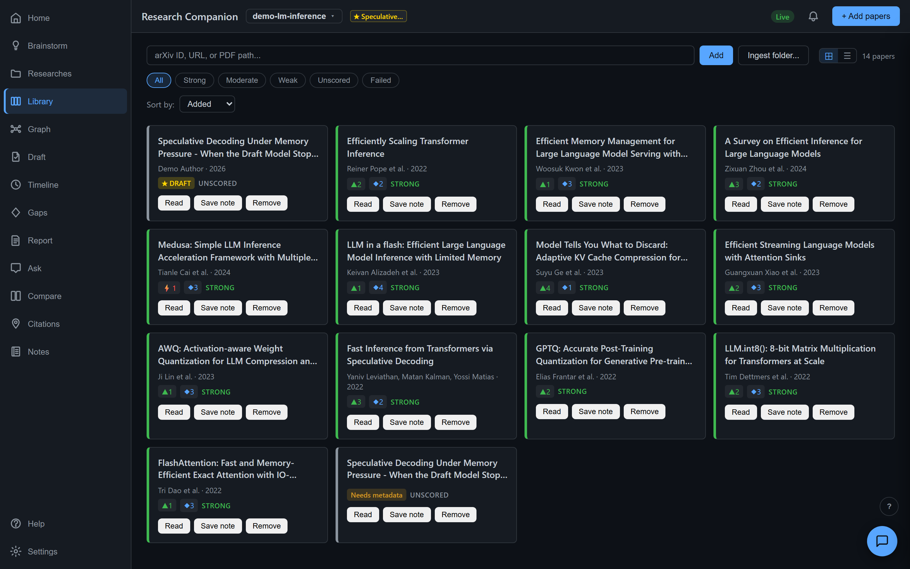

If a publisher blocks the automatic download — some do, even for articles they
themselves mark open access — the tool looks for a legitimate free copy
elsewhere first, including the paper's own arXiv preprint by title. What it
still cannot fetch is queued under **Needs you** with a plain-language reason
naming the publisher that refused, and a button that opens the article in
your browser. Download the PDF yourself and add it, or retry the whole queue
later with `research-companion acquire --all`.

<br>

### 2 · It maps the ideas, not the citations

Five papers using one method become **one node** linked to all five — concepts,
methods, datasets, claims and results, drawn from the papers themselves. This is
what your corpus is actually made of.

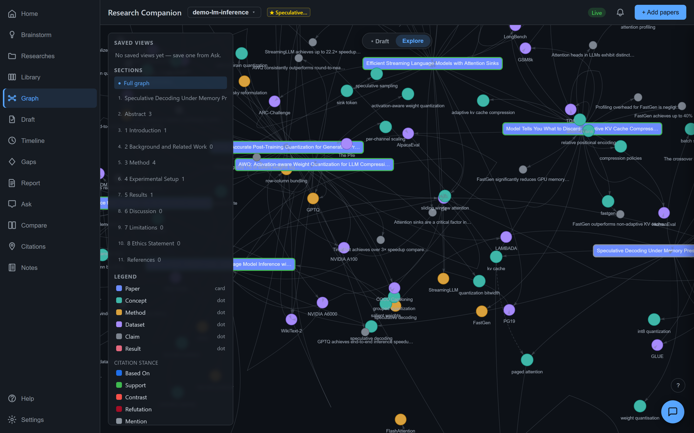

> **What it is honest about:** this is density *within your corpus*, not the field.
> Load six papers on one method and that method will look dominant.

<br>

### 3 · Ask it anything

Plain language in, an answer out — with a citation after every claim, down to the
**paper and section**. Click any citation to open the source at that passage.

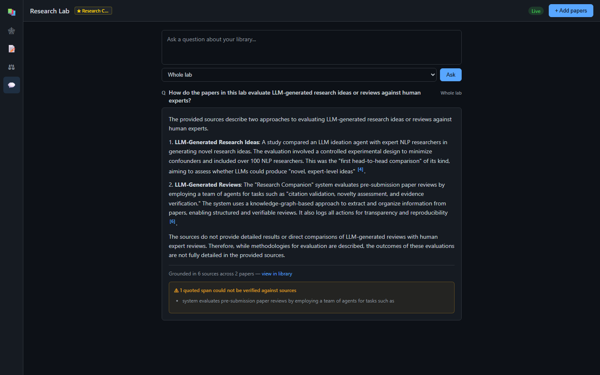

> **What it is honest about:** if your library does not cover the question, it says
> so rather than guessing. That refusal is the feature.

<br>

### 4 · Put two papers side by side

Shared ground, unique contributions, and a metric table built from what each
paper actually reported — a dash where a paper simply did not measure that.

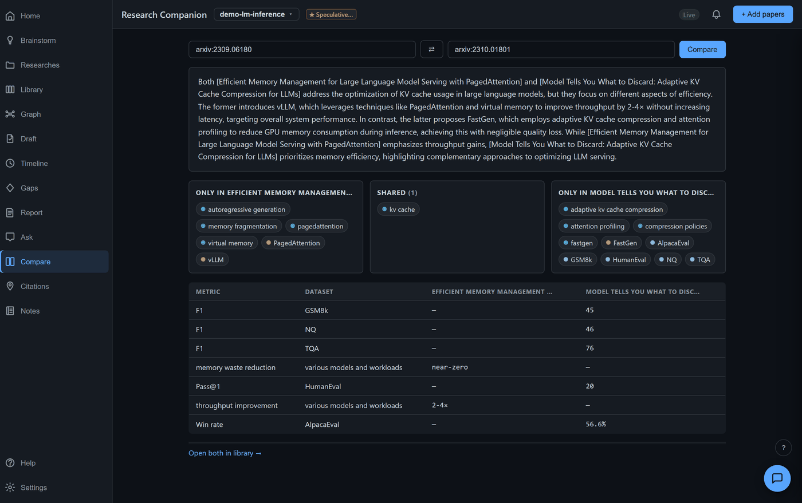

<br>

### 5 · See what is still unsolved

Every paper's own stated limitations and future work, gathered across the whole
library and marked open, partial or addressed. Not the tool guessing where the
gaps are — **the authors saying it**, with the quote to prove they did.

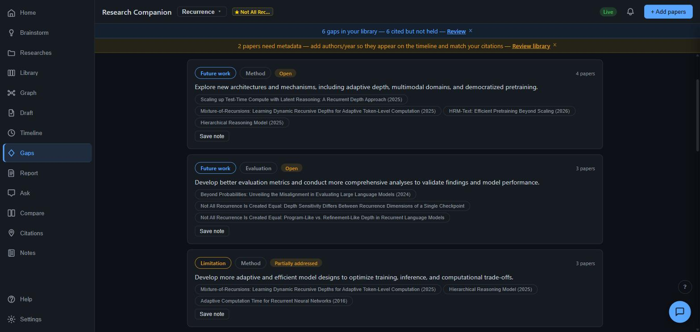

The same gaps laid over a timeline of when each concept, method and dataset
entered your corpus — so "this is new" becomes something you can look at.

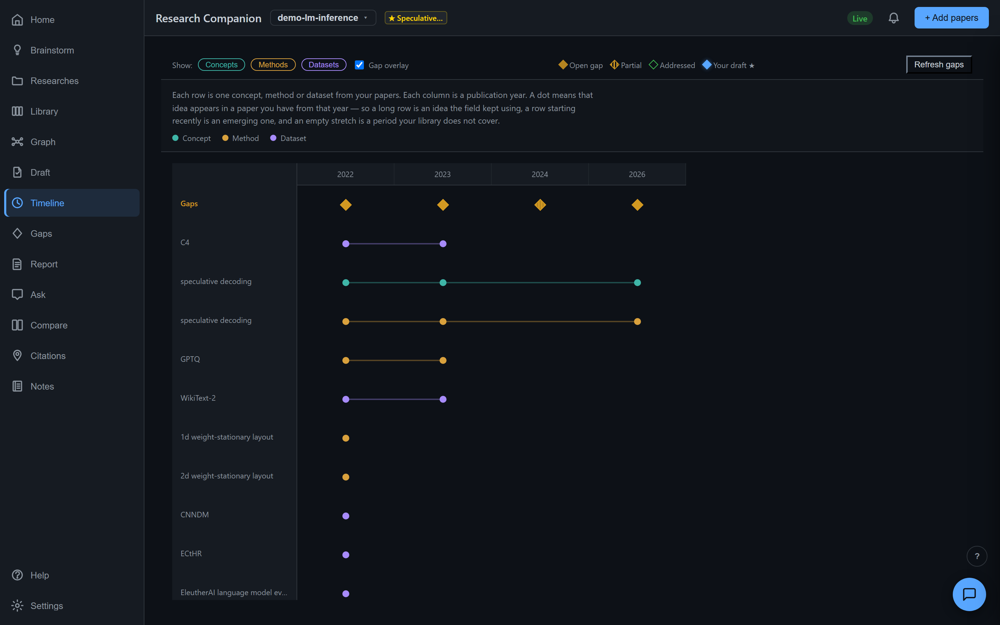

Read a gap, have a thought, write it down — and the note remembers **where you
were standing when you had it**. Not just which paper it concerned: the gap you
were looking at, with one click back to it.

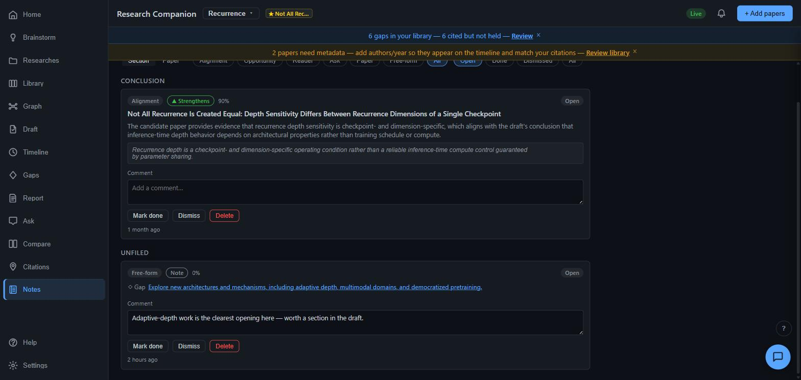

Three weeks later that is the difference between a sentence you trust and a
sentence you have to re-derive. And if the gap is ever re-clustered away, the
note still reads — it just stops being a link. Less information, never a broken
screen.

<br>

### 6 · Or start with no papers at all

Type a topic and it searches real catalogues — OpenAlex, Semantic Scholar,
arXiv, Crossref, PubMed — and hands you the results to add one at a time.

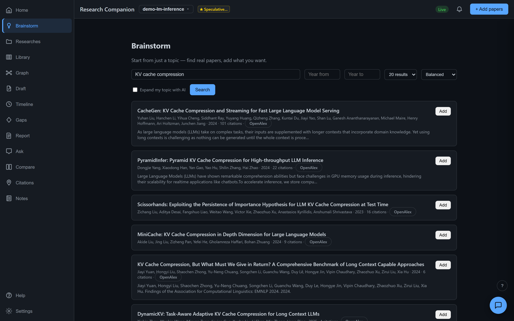

Then it turns what you collected into directions you could actually work on,
each one citing the papers and the open gaps behind it — and telling you exactly
how much it read to get there.

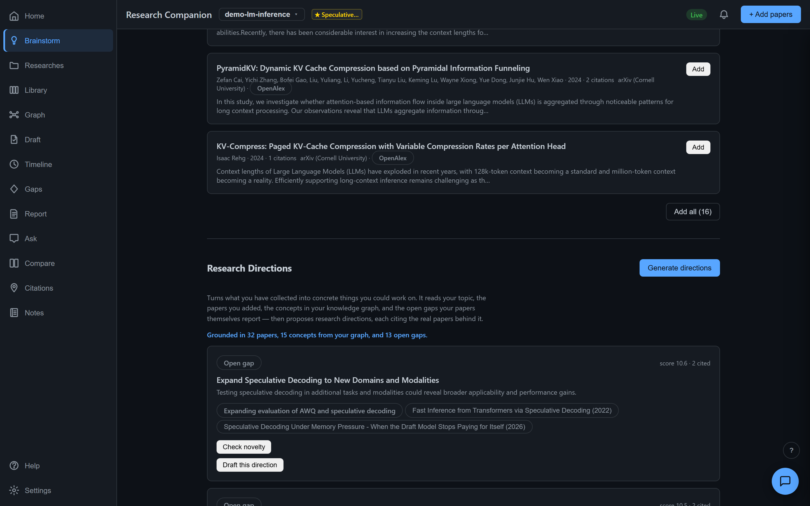

<br>

### 7 · Write, with the literature beside you

Set your draft and every section is checked against your papers: which strengthen
it, which challenge it, which offer an alternative — each with the located quote
behind the judgement, marked verified or unverified.

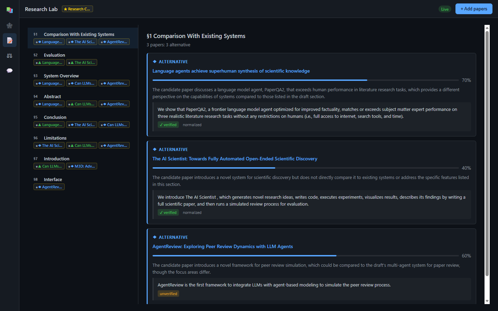

<br>

### 8 · Check where you cited it, not just whether

Every reference in your bibliography matched against your library, and every
in-text citation compared against the section it is *most relevant to*. Citing a
paper in Related Work when it belongs in Results is the kind of thing a reviewer
notices and you do not.

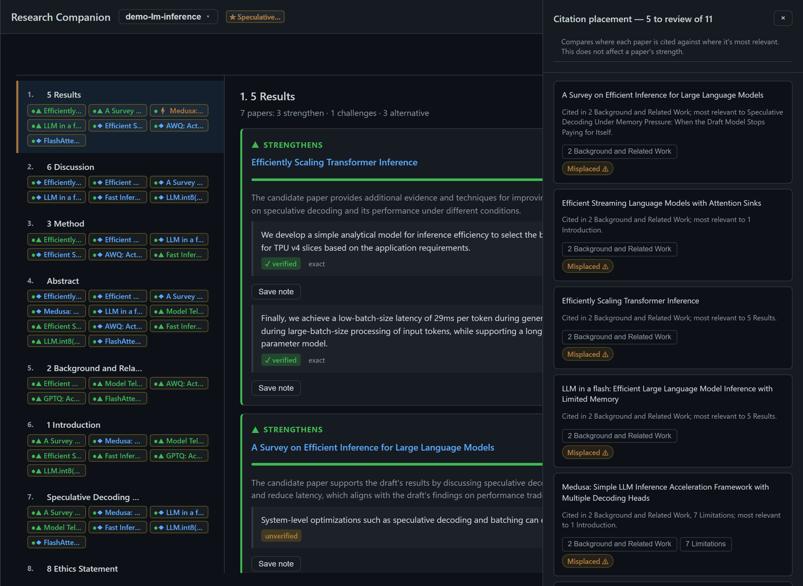

<br>

### 9 · Get a cited review of your own library

A topic becomes investigation questions you can edit **before** paying to answer
them — planning is one model call, answering is one per question.

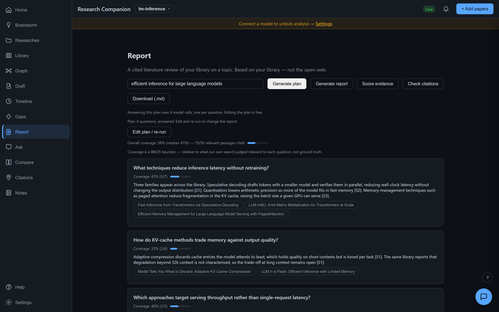

> **What it is honest about:** the coverage number in that screenshot reads 1%,
> and it is left there. It counts passages our own keyword search judged relevant
> — a low number means the search cast a wide net, not that the answer is wrong.
> Reporting it flattered would make it useless.

<br>

### 10 · Check it before anyone else does

The last step costs nothing at all — no API key, no network beyond the public
catalogues. Every reference looked up for real, every reported statistic
recomputed, every venue rule checked.

```bash
research-companion refcheck    <paper_id>             # do the references exist?
research-companion check-stats <paper_id>             # do the numbers add up?
research-companion check-compliance <paper_id> --venue neurips
```

```text
OK [verified]   Vaswani et al. Attention is all you need. NeurIPS
OK [verified]   Devlin et al. BERT: pre-training of deep bidirectional transformers
XX [unverified] Zzyzx Q. Nonexistent. A paper that was never written anywhere.

Summary: 39 verified, 0 suspect, 1 unverified (40 references)
```

<br>

---

## What makes it different

Most tools give you one axis: right or wrong, green or red. Research Companion
separates **four** states, everywhere, and refuses to collapse them.

| | means | shown as |
|---|---|---|
| **Verified** | a completed check established it | ✓ green |
| **Advisory** | a model judged it — not a fact | ⚑ amber |
| **Could not check** | attempted, could not finish | – muted |
| **Not applicable** | meaningless for this document | – muted |

A missing reference is never called *fabricated*. Zero statistics found is never
reported as *passed*. An unreachable catalogue is never evidence of absence.
That distinction is enforced in the type system, not left to copy discipline.

---

## Contents

- [The tour](#the-tour)
- [What makes it different](#what-makes-it-different)
- [Why Research Companion](#why-research-companion)
- [Quickstart](#quickstart)
- [Features](#features)
- [Claude Code skills](#claude-code-skills)
- [Installation](#installation)
- [Usage](#usage)
- [Documentation](#documentation)
- [Configuration & security](#configuration--security)
- [Roadmap](#roadmap)
- [Contributing](#contributing)
- [License](#license)

---

## Why Research Companion

Reading 50 papers to get up to speed on a field takes weeks. Existing tools fall into two camps, and neither does what researchers actually want — a graph of *ideas* (not just citations) built from *your own* corpus, that you can both navigate and chat with, on your own machine.

| | Open source | Concept graph | Chat over papers | Self‑hosted | Your own corpus |
|---|:---:|:---:|:---:|:---:|:---:|
| Connected Papers | ✗ | ✗ (citation‑only) | ✗ | ✗ | ✗ |
| ResearchRabbit | ✗ | ✗ | ✗ | ✗ | partial |
| Elicit / Consensus | ✗ | ✗ | ✓ | ✗ | partial |
| Semantic Scholar | partial API | ✗ | ✗ | ✗ | ✗ |
| **Research Companion** | **✓** | **✓** | **✓** | **✓** | **✓** |

Research Companion builds a **concept‑level** knowledge graph — concepts, methods, datasets, claims, results, citations — from your PDFs and arXiv links, then lets you **navigate** it visually and **chat** with it. Every answer cites the exact papers (and sections) it drew from, so you verify before you cite. Then it turns the same discipline on the paper *you're* writing: alignment scoring, an agentic review team, and integrity checks that open with a single **ready / revise / not ready** verdict.

> **Local‑first & honest by design.** The deterministic core runs with no API key and no network; anything that costs money or sends data anywhere is opt‑in, and the tool stays byte‑identical when a feature is off.

---

## Quickstart

```bash
git clone https://github.com/LaraibOSS/Research-Companion.git
cd Research-Companion
pip install -e .

# 1) Add a couple of papers, build the cross-paper graph
research-companion add https://arxiv.org/abs/2404.16130   # GraphRAG
research-companion add https://arxiv.org/abs/2410.05779   # LightRAG
research-companion build

# 2) Explore it
research-companion view                                    # interactive HTML graph
research-companion chat "how do GraphRAG and LightRAG differ?"   # cited answer
```

Prefer the browser workspace? Install the server extra and open the **Research Lab**:

```bash
pip install -e ".[server]"
research-companion lab serve      # opens http://127.0.0.1:8765
```

Drop a folder of PDFs into the Lab and papers stream into a live graph in real time. No API key? Try the fully offline demos:

```bash
python examples/demo_offline.py        # agentic review pipeline (6 lanes + rebuttal)
python examples/demo_lab_offline.py    # Research Lab event replay (papers, graph, strength)
```

> **Note on versions:** the source tree is at `0.8.0`; the latest PyPI release is `0.5.14`, so an editable install from source is ahead of PyPI until `0.8.0` ships.

---

## Features

### 📚 Ingest & knowledge graph
- **Universal ingestion** — arXiv, DOI (Crossref), Semantic Scholar, and local PDFs; batch‑add from a file; folder ingest with a per‑file selection list and live status.
- **Robust PDF reading** — pypdfium2 by default; the optional **Docling** engine adds OCR for scanned/image PDFs plus layout‑aware sections, tables, and reading order. Scanned PDFs that yield no text **fail honestly** instead of entering your library empty.
- **Concept‑level graph** — the same method appearing in five papers becomes **one node** with edges back to each; co‑occurring concepts get weighted `co_mentioned` edges. Every entity records **which papers it appears in**.

### 💬 Chat, Ask & Compare
- **Graph‑traversal RAG** — lexical seed → BFS over the graph → structured context → cited answer. The graph topology *is* the relevance signal (no embedding step required).
- **Verifiable answers** — click a `[n]` citation and the source paper opens scrolled to and highlighting the exact passage the answer used.
- **Ask & Compare** — token‑efficient, section‑scoped Q&A, and a structured head‑to‑head of any two papers.

### ✍️ Your draft, reviewed
- **Draft alignment** — every paper scored against the paper you're writing (`strengthens / challenges / alternative`) with verified evidence quotes and a strong / moderate / weak strength colour. A draft set or created after its library was ingested shows its own outline immediately; one click on **Analyze this draft** aligns every library paper against it in the background (opt‑in, since it uses your model).
- **Agentic review** — a team of lanes (citation, prior‑art, novelty, statistical soundness, reproducibility, ethics, overlap, venue‑fit, compliance) topped by a single **submission‑readiness verdict** and a cross‑lane "fix this first" list.
- **Integrity checks** — desk‑reject compliance linter, p‑value/GRIM statistics recompute, and near‑duplicate/paraphrase overlap detection — deterministic and LLM‑free at the core.
- **Rebuttal assistant** — grounded, point‑by‑point replies to reviewers; any span the model can't ground is flagged `CHECK` rather than shipped.

### 🔎 Discover & interoperate
- **Discover missing papers** — topic search and citation‑expansion via Semantic Scholar (free, no key), deduped against your library.
- **Domain connectors** — opt‑in **PubMed**, **Europe PMC**, and **DBLP** so biomedical and CS references verify and prior‑art reaches beyond the general databases.
- **Interoperability** — BibTeX/RIS export, `.bib` import from Zotero/Mendeley, LaTeX `\cite`‑key resolution, and Obsidian/Markdown/CSV/JSON graph export.
- **MCP trust‑layer server** — four deterministic, key‑free verification tools for any MCP‑capable agent (plus two opt‑in costed tools behind an explicit setting and cost cap).
- **Claude Code skills** — `/refcheck` and `/submission-check` run the free, deterministic checks from inside Claude Code, on a scratch workspace that never touches your real research. See [Claude Code skills](#claude-code-skills).

### 🧪 Research Lab (browser)
- **Live‑growing graph** over SSE, section‑wise subgraphs that keep retrieval focused, a built‑in reader (Text + original‑PDF tabs), a **Simplified** plain‑English reader, **Notes** you can capture anywhere and export as a revision checklist, an adaptive **Home** dashboard (a genuinely empty workspace opens on a two‑path first‑run chooser — *Brainstorm from an idea* or *I already have a draft* — then a product intro with quick‑nav to every tab, then a compact journey view with next‑steps and a timeline once you have a draft), and a **Researches** tab: a sortable table tracking every research — papers/analyzed/failed, draft + version count, citation coverage, strength mix, open items, and draft‑updated / last‑activity / created — with a persistent **+ New research** button plus rename / archive / delete.
- **Brainstorm tab** — start from just a topic: search the literature (optionally AI‑expanded into related queries), see what's already in your library at a glance, and add what you want; then **Generate directions** to turn your library + discovery results + open gaps into a ranked, citation‑backed list of research directions, **Check novelty** on any one of them to get a grounded verdict against real prior work, **Generate brief** to turn your session's papers into section headings seeded with cited, editable, note‑able bullet points to write around, and **Draft this direction** to turn a direction into a real, editable draft outline that flows straight into your existing draft pipeline. Your whole Brainstorm session (topic, papers, directions, the brief) is saved per research, so it's still there when you come back — the front door of the ideation pipeline.
- **Gaps tab** — every paper's self-declared limitations/future-work, synthesized into deduped, citation-backed, ranked themes across your whole library — typed (limitation/future-work), classified (method/resources/evaluation/application/problem), and flagged open/partial/addressed, complementing the Timeline's per-paper diamond view.
- **Report tab** — turn a topic into a structured, cited literature review over your own library: 4–6 LLM-generated investigation sub-questions grounded in your library's own concepts and papers, each answered by the same grounded, quote-verified Q&A engine behind Ask — with citation chips back to the exact paper/section — run as a background job with live "Answering N/M" progress; scope is explicitly your library, never the open web. Before running the (more expensive) answering pass, an editable **research plan** lets you review, edit, add, remove, and reorder the generated investigation questions — then **Run report** answers exactly the set you approved; the original one-click "Generate report" one-shot flow still works unchanged for anyone who wants to skip the checkpoint. An opt-in **Score evidence** pass rates each citation for relevance to its question and stance (supports/contradicts/neutral) toward its answer — an honest, clearly-labeled AI judgment, never presented as "verified". Every report also carries a free, LLM-free **coverage** signal — a per-question and overall bar showing how much of the library material our own search judged relevant actually made it into the citations, always labeled a BM25 heuristic (not ground truth) with auditable raw counts. A one-click **Download (.md)** lets you save or share the whole report as a plain markdown file — the same citations, badges, and honesty caveats, never stripped of context.
- **Honest "no research selected" state** — fresh installs and fully‑emptied libraries show a plain **Research: none** in the top bar instead of a hidden default workspace; `main` is now an ordinary, renamable research like any other.

<sub>📄 Full version history lives in the release notes: [0.8](docs/RELEASE_0.8.md) · [0.7](docs/RELEASE_0.7.md) · [0.6](docs/RELEASE_0.6.md) · [0.5](docs/RELEASE_0.5.md) · [0.4](docs/RELEASE_0.4.md) · [0.3](docs/RELEASE_0.3.md) · [0.2](docs/RELEASE_0.2.md)</sub>

---

## Claude Code skills

The checks that need no model also need no UI. Two [Claude Code](https://claude.com/claude-code)
skills live in [`skills/`](skills/) and answer a question directly on a PDF:

| skill | question | cost |
|---|---|---|
| [`/submission-check`](skills/submission-check/SKILL.md) | Would this get desk-rejected? Venue rules, statcheck/GRIM, self-overlap. | free |
| [`/refcheck`](skills/refcheck/SKILL.md) | Do these references actually exist? CrossRef / OpenAlex / arXiv. | free (network only) |

```bash
cp -r skills/refcheck skills/submission-check ~/.claude/skills/
```

```
/refcheck paper.pdf
/submission-check paper.pdf --venue neurips
```

They also trigger on the question phrased naturally — "are these citations real?",
"will this get desk-rejected?".

Both default to a **scratch workspace**, so an agent invoked from any directory
cannot write into whichever research you last had open. And both follow the same
reporting rule as the rest of the tool: a check that did not run is never shown
as a check that passed, and a reference that could not be found is reported as
*not found*, never as fabricated. Details and the rationale: [`skills/README.md`](skills/README.md).

## Installation

```bash
git clone https://github.com/LaraibOSS/Research-Companion.git
cd Research-Companion
pip install -e ".[server]"      # core + Research Lab server (fastapi, uvicorn)

# you also need ONE of:
export ANTHROPIC_API_KEY=sk-ant-...   # default provider
# or
export OPENAI_API_KEY=sk-...          # use --provider openai
```

**Better PDF ingestion (optional):**

```bash
pip install "research-companion[docling]"   # OCR + layout-aware parsing
```

The core install parses digital PDFs with pypdfium2. **Docling** adds OCR for scanned/image PDFs plus layout‑aware sections and table/figure capture; it's auto‑detected when present (override with `RESEARCH_COMPANION_PARSER=pypdfium|docling`). Semantic search is optional — set `HF_TOKEN` to enable hybrid retrieval, otherwise BM25 lexical search is used.

---

## Usage

```bash
# Add papers — arXiv, DOI, Semantic Scholar, or local PDF
research-companion add https://arxiv.org/abs/2404.16130
research-companion add ./my-paper.pdf --title "My Paper" --authors "Alice,Bob" --year 2024
research-companion add -f examples/graph-rag-corpus/papers.txt   # batch, one per line

research-companion cost-estimate     # ~$0.02–$0.20 per paper before you build
research-companion build             # extract entities + build the cross-paper graph
research-companion view              # interactive graph in the browser
research-companion chat "what are the main approaches?"   # cited answer (or REPL)
```

Output lands in `~/.research-companion/` (override with `PAPERGRAPH_DIR`):

```
~/.research-companion/
├── papers/arxiv__2404_16130/{paper.pdf, metadata.json, text.txt, extraction.json}
├── graph.json     # NetworkX node-link format, hackable
└── graph.html     # interactive viz, double-click to open
```

<details>
<summary><b>Full CLI reference</b></summary>

```
research-companion add <url-or-pdf>... [-f FILE] [--title T] [--authors A,B] [--year Y]
research-companion build [--provider anthropic|openai] [--model M] [--force]
research-companion cost-estimate [--provider anthropic|openai] [--model M]
research-companion discover <topic> [-n LIMIT] [--year-min Y] [--year-max Y] [--add] [--json]
research-companion discover --expand [-n LIMIT] [--min-citations N] [--add] [--json]
research-companion view [--no-open]
research-companion chat [<question>] [--provider P] [--depth N]
research-companion search <query> [-k concept|method|...] [-n LIMIT] [--json]
research-companion list [--json]
research-companion remove <paper-id>
research-companion stats
research-companion export [--format markdown|csv|json|obsidian] [--output DIR]

# Research Lab (requires the [server] extra)
research-companion lab serve [--port N] [--no-open]
research-companion lab ingest <folder>
research-companion lab failures
research-companion set-draft <paper-id>
research-companion align <paper-id> [--against <draft-id>] [--force]
research-companion ask "<question>" [--section <section-id>]
research-companion compare <paper-a> <paper-b>
research-companion gaps [--refresh] [--json]
research-companion timeline [--json]

# Multiple researches (workspaces)
research-companion workspace list      # * marks the active workspace
research-companion workspace create <name>
research-companion workspace use <name>

# Review & integrity checks
research-companion review <paper-id> [--venue SLUG] [--fast] [--report DIR] [--serve] [--json]
research-companion refcheck <paper-id> [--connectors europepmc,pubmed,dblp] [--json]
research-companion check-compliance <paper-id> --venue SLUG [--json]   # desk-reject linter
research-companion check-stats <paper-id> [--json]                     # Statcheck + GRIM
research-companion check-overlap <paper-id> [--semantic] [--allow-remote] [--json]
research-companion rebuttal <paper-id> --reviews FILE [--tone deferential|balanced|firm]
research-companion mcp serve                                           # MCP trust-layer server

# Interoperability
research-companion export-bib [--format bibtex|ris] [--output FILE]
research-companion import-bib <file.bib>
research-companion cite-tex <paper.tex>
```
</details>

<details>
<summary><b>Programmatic API</b></summary>

```python
from research_companion import add_paper, build_graph, chat, view

add_paper("https://arxiv.org/abs/2410.05779")
add_paper("10.1145/1234567.1234568")       # DOI
G = build_graph()                          # NetworkX Graph
view()                                     # opens HTML
ans = chat("what is GraphRAG?")
print(ans.answer)                          # cited answer
print(ans.papers)                          # papers used in retrieval
```
</details>

<details>
<summary><b>Supported paper sources & what gets extracted</b></summary>

| Source | Example | Metadata | PDF |
|--------|---------|----------|-----|
| **arXiv** | `2410.05779` or `https://arxiv.org/abs/2410.05779` | arXiv API | always free |
| **DOI** | `10.1145/...` or `https://doi.org/10.1145/...` | Crossref API | varies (paywalled = metadata only) |
| **Semantic Scholar** | S2 URL or 40‑char hex ID | S2 API | via arXiv/DOI fallback |
| **Local PDF** | `./paper.pdf` | manual `--title`/`--authors` | your file |

Each paper yields structured entities merged into the cross‑paper graph:

```json
{
  "concepts":     [{"name": "Knowledge graph", "definition": "..."}],
  "methods":      [{"name": "GraphRAG", "description": "..."}],
  "datasets":     [{"name": "HotpotQA", "description": "..."}],
  "claims":       [{"text": "Graph-based RAG outperforms vector RAG on multi-hop."}],
  "results":      [{"metric": "F1", "value": "78.9", "dataset": "HotpotQA"}],
  "related_work": ["Lewis et al. 2020", "..."]
}
```
</details>

<details>
<summary><b>How the chat works (graph‑traversal RAG)</b></summary>

1. **Lexical seed selection** — find top‑K nodes whose label/definition matches your question terms.
2. **BFS** — expand outward from those seeds (default depth 2) to assemble a relevant subgraph.
3. **Render** — turn the subgraph into structured text context (papers, concepts, methods, results, relationships).
4. **Answer** — send context + question to Claude/GPT with a citation‑required system prompt.

No embedding step: the graph topology is the relevance signal. For research papers — where the value is in *cross‑paper* relationships, not nearest‑neighbour chunks — graph traversal gives a more useful retrieval pattern. Re‑running `build` is **free**; extractions are cached and only re‑run when the prompt changes.
</details>

---

## Documentation

- **[Walkthrough](docs/WALKTHROUGH.md)** ([PDF](docs/WALKTHROUGH.pdf)) — start here. One researcher, one topic, every feature in order: create a research, brainstorm it into a library, build the graph, and take a draft through to submission checks. Diagrams at each stage.
- **[Full Documentation](docs/DOCUMENTATION.md)** ([PDF](docs/DOCUMENTATION.pdf)) — the single consolidated reference: overview, architecture, every feature, CLI, agents, Lab UI, tech stack, and roadmap.
- **[User Manual](docs/USER_MANUAL.md)** ([PDF](docs/USER_MANUAL.pdf)) — every feature, how to use it, and how to read outputs honestly.
- **[Developer Guide](docs/DEVELOPER_GUIDE.md)** — how the ingestion pipeline works end to end and how to extend or test it.
- **[Venue KB](docs/VENUE_KB.md)** — the cross‑discipline venue knowledge base and how to extend it.
- **[Roadmap](docs/ROADMAP.md)** — what's shipped and what's next.

---

## Configuration & security

API keys (`ANTHROPIC_API_KEY`, `OPENAI_API_KEY`, and optional `HF_TOKEN` for semantic search) belong in a local `.env` file with `0600` permissions — never committed. You can manage all keys and settings from the Settings page in the Research Lab.

| Variable | Purpose | Default |
|---|---|---|
| `RESEARCH_COMPANION_DIR` | Where papers + graph are stored | `~/.research-companion/` |
| `RESEARCH_COMPANION_WORKSPACE` | Force a research (workspace) for one command | active workspace |
| `ANTHROPIC_API_KEY` | Required for `--provider anthropic` (default) | – |
| `OPENAI_API_KEY` | Required for `--provider openai` | – |
| `RESEARCH_COMPANION_PROVIDER` | Default provider (`anthropic` / `openai`) | `anthropic` |
| `RESEARCH_COMPANION_MODEL` | Override the model id | provider default |
| `HF_TOKEN` | Optional — enables hybrid semantic search (else BM25) | – |
| `RESEARCH_COMPANION_PARSER` | Force `pypdfium` or `docling` | auto |
| `NCBI_EMAIL` / `NCBI_API_KEY` | Optional — raises PubMed/E-utilities rate limits | – |

Cost guidance per paper (Claude Sonnet): ~$0.02–$0.10 per extraction depending on length. Run `research-companion cost-estimate` to project costs before building.

---

## Roadmap

Shipped across **v0.1 → v0.7**: CLI + graph + cited chat → Research Lab UI → guided journey & discovery → isolated workspaces → citation coverage & robust ingestion → reviewer‑grade integrity checks → the integrity & trust layer (MCP server, readiness verdict, statistical/compliance/overlap checks, domain connectors).

**Next:** true web‑corpus plagiarism detection and additional entity‑metadata sources. Full detail in **[docs/ROADMAP.md](docs/ROADMAP.md)**.

---

## Contributing

PRs welcome — anyone can raise one. See **[CONTRIBUTING.md](CONTRIBUTING.md)** for setup, design principles, and the PR checklist, and **[SECURITY.md](SECURITY.md)** for reporting vulnerabilities privately. The codebase is intentionally small (MIT‑licensed, no heavy frameworks). Every PR must pass the three gates CI runs on Python 3.10–3.13 across Ubuntu and Windows:

```bash
pip install -e ".[dev]"
python -m pytest -q
node --test tests/js/*.test.mjs
ruff check research_companion tests examples
```

## Acknowledgements

Design inspired by [GraphRAG](https://github.com/microsoft/graphrag) (Microsoft Research) for the cross‑document community‑summary concept.

## License

MIT © 2026 Laraib Hasan
