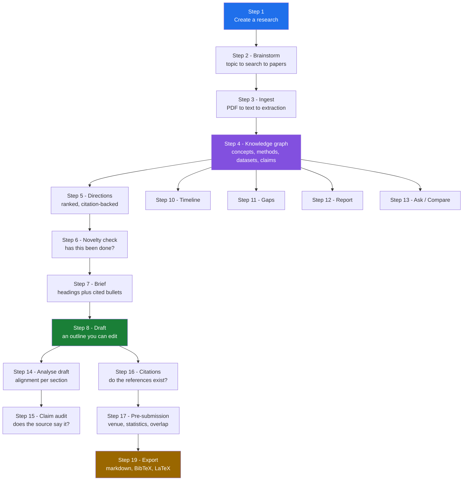
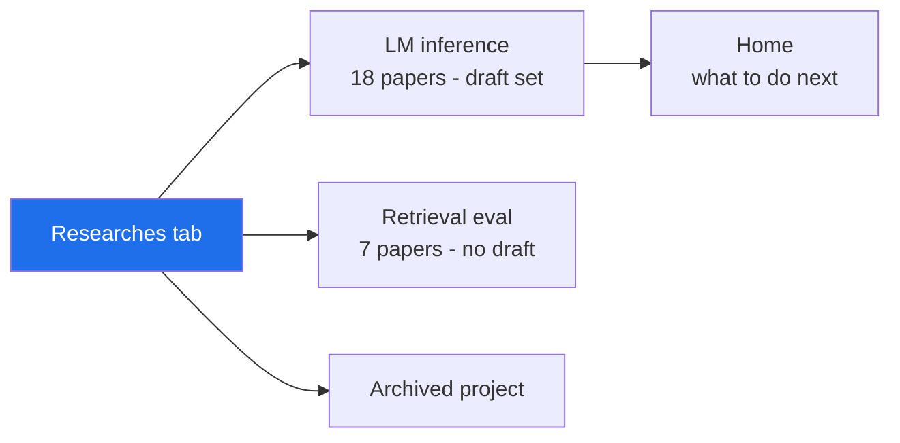
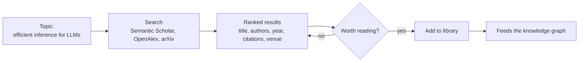
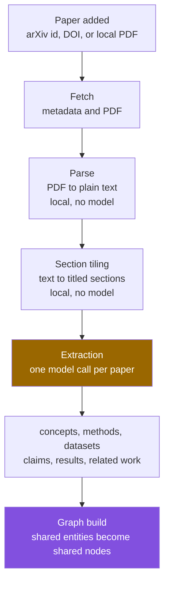
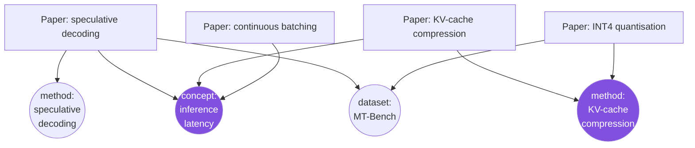
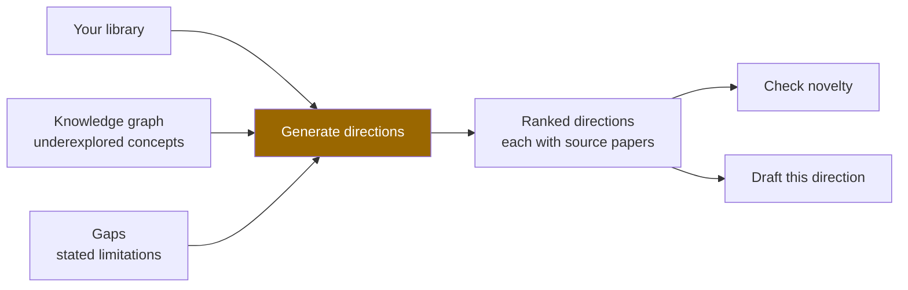
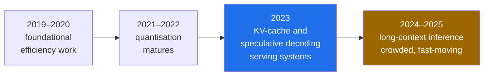
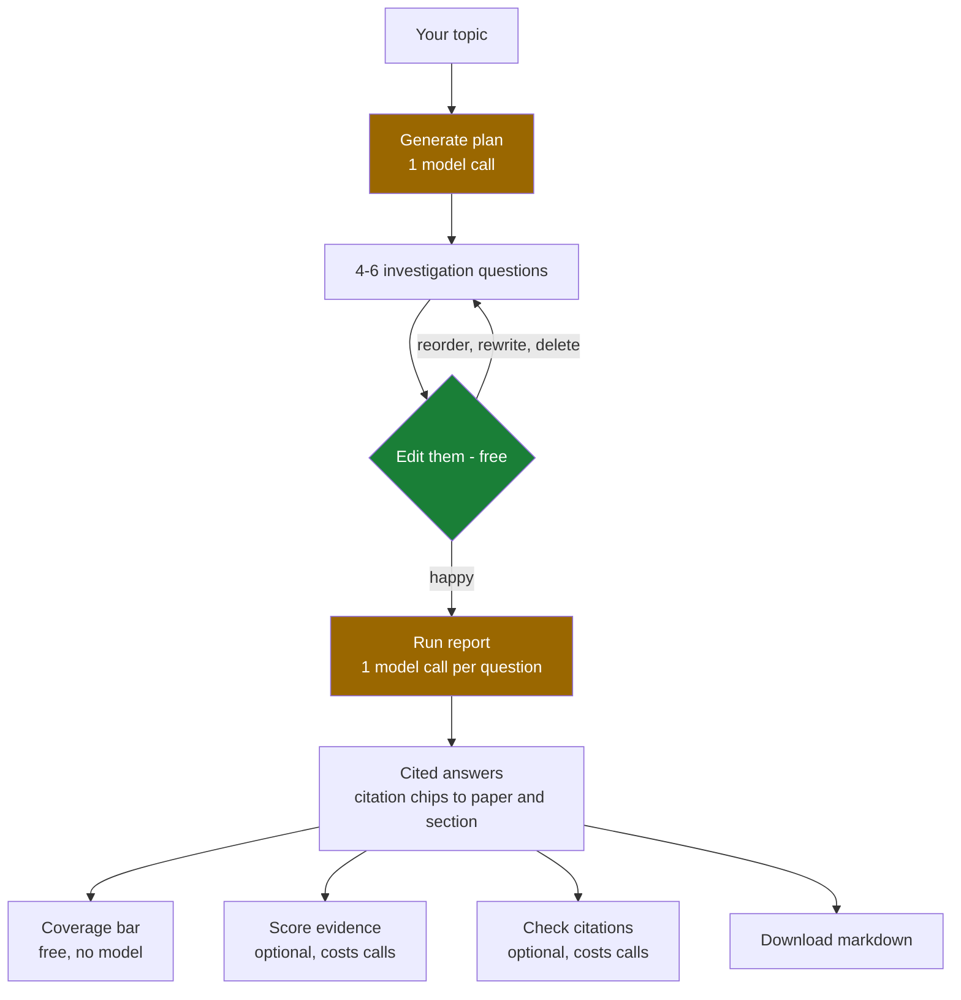
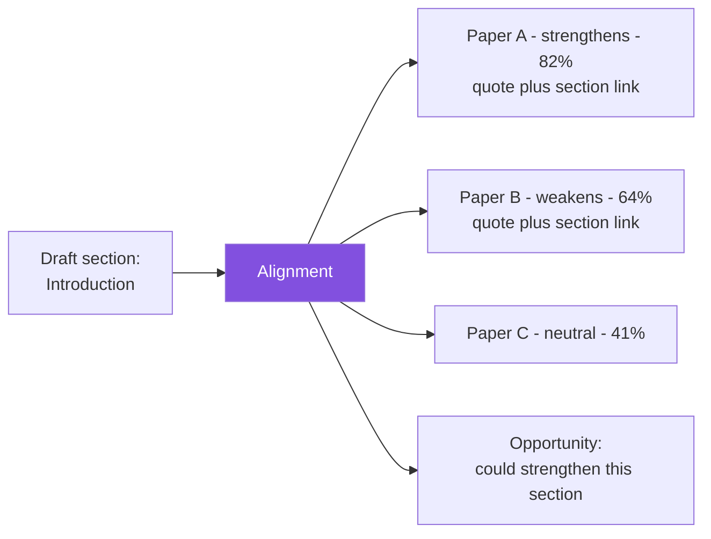

# A researcher's walkthrough

**Follow this end to end and you will have used every part of Research Companion.**

You do not need to know the tool, the CLI, or anything about the topic. Every step
says what to type or click, what you get back, what the tool is doing underneath,
and how to decide what to do next.

The running example is a researcher starting cold on **LM inference** — no papers,
no draft, no idea what the open problems are.

---

## Contents

- [Before you start](#before-you-start)
- [The whole journey in one picture](#the-whole-journey-in-one-picture)
- [Step 1 — Create a research](#step-1--create-a-research)
- [Step 1b — Home and Researches](#step-1b--home-and-researches-knowing-where-you-are)
- [Step 2 — Brainstorm: from a topic to a library](#step-2--brainstorm-from-a-topic-to-a-library)
- [Step 3 — What happens when a paper is added](#step-3--what-happens-when-a-paper-is-added)
- [Step 4 — The knowledge graph](#step-4--the-knowledge-graph)
- [Step 5 — Research directions](#step-5--research-directions)
- [Step 6 — Novelty check](#step-6--novelty-check)
- [Step 7 — The brief](#step-7--the-brief)
- [Step 8 — Turn a direction into a draft](#step-8--turn-a-direction-into-a-draft)
- [Step 9 — Read, and keep notes](#step-9--read-and-keep-notes)
- [Step 10 — Timeline: how the field moved](#step-10--timeline-how-the-field-moved)
- [Step 11 — Gaps: what the papers admit is unfinished](#step-11--gaps-what-the-papers-admit-is-unfinished)
- [Step 12 — Report: a cited literature review](#step-12--report-a-cited-literature-review)
- [Step 13 — Ask and Compare](#step-13--ask-and-compare)
- [Step 14 — Analyse your draft against the literature](#step-14--analyse-your-draft-against-the-literature)
- [Step 15 — Are the cited sources actually saying that?](#step-15--are-the-cited-sources-actually-saying-that)
- [Step 16 — Citations: does your bibliography hold up?](#step-16--citations-does-your-bibliography-hold-up)
- [Step 17 — Pre-submission checks](#step-17--pre-submission-checks)
- [Step 18 — From inside Claude Code](#step-18--from-inside-claude-code)
- [Step 19 — Export](#step-19--export)
- [What it costs](#what-it-costs)
- [What it will never do](#what-it-will-never-do)
- [Quick reference](#quick-reference)

---

## Before you start

```bash
pip install "research-companion[server]"
```

You need **one** model key — Anthropic or OpenAI. Put it in a `.env` beside where
you run the tool (copy `.env.example`), or paste it into Settings later:

```bash
cp .env.example .env      # then fill in ANTHROPIC_API_KEY or OPENAI_API_KEY
```

Start the browser Lab:

```bash
research-companion lab serve
```

Open **http://127.0.0.1:8800**. Everything below happens there, and every step
also shows the terminal equivalent if you prefer the CLI.

> **Your papers stay on your machine** except when a step explicitly calls a model
> or a public catalogue. The deterministic half of the tool — search, graph,
> timeline, reference checking, statistics checking — runs with no key at all.

---

## The whole journey in one picture



Two things to notice before you begin.

**The knowledge graph is the hub.** Almost everything downstream reads from it.
That is why Steps 2–4 matter more than they look: the quality of everything after
depends on which papers you let in.

**Nothing is forced.** You can stop after Step 4 and just have a searchable, cited
library. You can skip Brainstorm entirely and start at Step 8 with a draft you
already wrote.

---

## Step 1 — Create a research

A **research** is an isolated workspace: its own papers, its own graph, its own
draft. Keeping projects apart matters, because a graph mixing LM inference papers
with unrelated ones produces worse directions and noisier gaps.

**Do this.** Open the Lab. On a fresh install you land on a two-path chooser — pick
**Brainstorm from an idea**. The top bar reads `Research: none` until you name one;
that is honest, not broken.

In **Brainstorm**, type your topic and click **Name your research**:

```
LM inference
```

Terminal equivalent:

```bash
research-companion workspace new "LM inference"
research-companion workspace use "LM inference"
```

**What you get.** An empty research, now active in the top bar. Every later step
writes here and nowhere else.

---

## Step 1b — Home and Researches: knowing where you are

Two tabs exist to answer "what now?" and "what else am I working on?".

**Home** is the dashboard. On an empty research it offers the two-path chooser.
Once you have papers it becomes a journey view: what you have done, what the
obvious next step is, and a timeline of recent activity. If you come back after a
fortnight and cannot remember where you left off, start here.

**Researches** is the table of every project you have — papers, how many are
analysed, how many failed, whether a draft is set and how many versions, citation
coverage, the mix of supporting versus contradicting evidence, open items, and when
each was last touched. Sortable, with rename / archive / delete and a **+ New
research** button.



Keep one research per project. It is the single most effective thing you can do for
the quality of directions, gaps and reports, because every one of them reads the
whole library.

---

## Step 2 — Brainstorm: from a topic to a library

You have a topic and nothing else. This step turns it into papers.

**Do this.** In **Brainstorm**, type a topic and click **Search**:

```
efficient inference for large language models
```

**What you get.** Real papers from the literature — title, authors, year, citation
count, venue. Papers already in your library are marked, so you never add the same
one twice.



**How to choose, as a newcomer.** You are not trying to be exhaustive. Aim for
**10–20 papers that disagree with each other** — a survey, two or three
highly-cited method papers, and something from the last year. A library of
near-identical papers produces directions that all say the same thing.

For LM inference that might mean KV-cache compression, speculative decoding,
quantisation, batching and serving systems. That spread is what later lets the
tool show you where the field is crowded and where it is thin.

Terminal equivalent:

```bash
research-companion discover "efficient inference for large language models"
research-companion add 2211.17192          # arXiv id, DOI, S2 id, or a local PDF
```

> **Why searching is free.** Catalogue search is a public API call, not a model
> call. You only start spending when a paper is analysed in Step 3.

---

## Step 3 — What happens when a paper is added

This is the only step that is mostly invisible, so here is exactly what runs.



**What you get.** Each paper becomes a structured record: what it claims, what
methods it uses, which datasets, what it reports, and what it cites. That record is
what lets later answers cite down to the *section*, not just the paper.

**Watch for.** Ingestion is asynchronous — keep working while it runs; the Activity
indicator shows progress. A scanned PDF with no text layer fails loudly rather than
silently producing an empty paper.

---

## Step 4 — The knowledge graph

**Do this.** Open the **Graph** tab.

**What you get.** A concept-level map of your library — not a citation network.
Nodes are the *ideas*: concepts, methods, datasets, claims. If five papers use
KV-cache compression, that is **one node linked to all five**.



**What this tells you at a glance.**

- A node touched by **many papers** is the crowded part of the field. Competing
  there needs a strong argument.
- A node touched by **one paper** is either a dead end or an opening. Step 11 helps
  you tell which.
- Two clusters that **share no nodes** are two conversations that have not met —
  often where the interesting work is.

Click a node to see every paper that touches it. Click a paper to open it in the
reader at the exact section.

---

## Step 5 — Research directions

You have a library and a graph. This step proposes what you could actually work on.

**Do this.** In **Brainstorm**, click **Generate directions**.

**What you get.** A ranked list of candidate directions, each carrying the papers
it came from — so you can check the reasoning rather than trust it.



A direction is a *hypothesis about where the work is*, generated by a model from
your library. It is a starting point for your judgement, not a verdict — the
citations under each one exist so you can disagree with it.

---

## Step 6 — Novelty check

**Do this.** On a direction you like, click **Check novelty**.

**What you get.** A grounded verdict on whether this has already been done, checked
against real prior work rather than the model's memory, with the papers that
support the verdict.

**Read it as:** *"here is prior work that looks close — decide for yourself."* A
"novel" verdict means nothing close was found **in the sources searched**, which is
not the same as nothing existing.

---

## Step 7 — The brief

**Do this.** Click **Generate brief**.

**What you get.** Section headings, each seeded with **cited bullet points** drawn
from your papers — the raw material of a related-work section. Every bullet links
back to its source, and you can attach your own notes to any of them.

This is the bridge between reading and writing: instead of a blank page you start
editing something that already has citations attached.

> Your whole Brainstorm session — topic, papers, directions, brief — is saved per
> research. Close the tab, come back tomorrow, it is still there.

---

## Step 8 — Turn a direction into a draft

**Do this.** On the direction you chose, click **Draft this direction**.

**What you get.** A real, editable draft outline in the **Draft** tab, structured
into sections, ready to flow into everything below.

Already have a draft? Skip all of the above — put your PDF or text in the Draft tab
and set it as the draft:

```bash
research-companion set-draft <paper_id>
```

---

## Step 9 — Read, and keep notes

**Do this.** Open **Library**, click any paper.

**What you get.** A reader with the original PDF and a text view, plus a
**Simplified** plain-English view for papers outside your area — useful when you
are new to a field and the notation is the obstacle.

Save anything you find with **Save note**: from an alignment card, an opportunity,
the reader, or a brief bullet. The **Notes** tab collects them into one filterable
list you can export as a revision checklist.

---

## Step 10 — Timeline: how the field moved

**Do this.** Open **Timeline**.

**What you get.** Your library laid out by publication year — when a method first
appears, which years are crowded, where the recent work sits.



**Why a newcomer should look here early.** It tells you whether the direction you
picked in Step 5 joins a *new* conversation or a *long-running* one. Both are fine;
they need very different framing in a paper.

---

## Step 11 — Gaps: what the papers admit is unfinished

**Do this.** Open **Gaps**.

**What you get.** Every paper's own stated limitations and future work, collected
and grouped into **themes across your whole library** — deduplicated, ranked and
citation-backed, typed (limitation vs future work), classified by kind (method,
resources, evaluation, application, problem), and flagged open / partial /
addressed.

This is the most under-used feature for a newcomer. It is not the tool guessing
where the gaps are — it is **the authors themselves** saying what they could not
do. A theme repeated by six papers is a real open problem, in their words.

---

## Step 12 — Report: a cited literature review

**Do this.** Open **Report**. Type a topic and click **Generate plan** first.



**Why plan first.** Planning is one call and editing is free; answering costs one
call per question. Reviewing the questions before paying for answers is the cheap
checkpoint — and it is usually where you notice the tool misread your topic.

**What you get.** A structured review of *your library* — never the open web —
where every claim carries a citation chip back to the exact paper and section.

**Reading the extras honestly:**

| signal | what it means |
|---|---|
| **Coverage** | how much of the material *our own keyword search* judged relevant actually got cited. A BM25 heuristic, not ground truth. |
| **Score evidence** | an AI judgement of each citation's relevance and stance (supports / contradicts / neutral). Labelled a judgement, never "verified". |
| **Check citations** | see Step 15. |

---

## Step 13 — Ask and Compare

**Ask** — a question in plain language, answered from your papers with a citation
after every claim. If your library does not cover it, it says so instead of
guessing. That refusal is the feature.

**Compare** — two papers side by side: what each claims, methods, datasets, and
where they agree or diverge. Useful when two papers report conflicting numbers and
you need to see why.

```bash
research-companion ask "why does KV-cache compression hurt long-context quality?"
research-companion compare <paper_a> <paper_b>
```

---

## Step 14 — Analyse your draft against the literature

**Do this.** Open **Draft**, click **Analyze this draft**.

**What you get.** For every section of your draft, the papers that relate to it —
each with a **stance** (strengthens / weakens / neutral), a relevance score, a
rationale, and a **verified quote** from the source.



Quotes are **verified** — checked to appear verbatim in the source, with a locator
that can find them again. A quote that cannot be located is shown as unverified
rather than quietly dropped.

---

## Step 15 — Are the cited sources actually saying that?

Existing checks answer two easier questions: does the reference *exist*, and does a
quote appear *verbatim*. Neither catches the failure that matters most: a real
citation attached to a claim the source never makes.

**Do this.** Turn on **claim_audit** in Settings, then click **Check citations** in
Draft or Report.

**What you get.** A verdict per cited passage:

| verdict | meaning |
|---|---|
| **Supported** | the passage supports the claim |
| **Not supported** | it does not — *the only adverse verdict* |
| **Could not check** | passage unavailable, or the model was unsure |
| **No anchor** | the citation has no locator to check against |
| **Not checked** | the audit did not run |

The last three are **failures to check**, not findings against the citation, and
are shown that way. The auditor is deliberately biased toward "unclear": at the
rate real miscitation occurs, a noisy checker's warnings would be mostly wrong, and
people would learn to ignore all of them.

> Costs one model call per cited passage. That is why it is opt-in.

---

## Step 16 — Citations: does your bibliography hold up?

**Do this.** Open **Citations**, or run:

```bash
research-companion refcheck <paper_id>
```

**What you get.** Every reference looked up in CrossRef, OpenAlex and arXiv — with
**no model calls at all**.

| verdict | meaning |
|---|---|
| **verified** | a matching record was found and the details agree |
| **suspect** | a record was found but something disagrees — often a typo, or a preprint/published mismatch |
| **not found** | no matching record **in the catalogues searched** |

**"Not found" is not "fabricated."** Books, theses, workshop papers, technical
reports, very recent preprints and non-English venues land there routinely. Treat
it as *check this one by hand*. For biomedical work add `--connectors europepmc`,
or PubMed-only references will look missing for lack of coverage.

The output also reports lines it **could not parse** as references. Those were
never checked, and they are counted separately so the totals cannot be mistaken for
the whole bibliography.

---

## Step 17 — Pre-submission checks

All three are deterministic and cost nothing.

```bash
research-companion check-compliance <paper_id> --venue neurips
research-companion check-stats      <paper_id>
research-companion check-overlap    <paper_id>
```

| check | catches |
|---|---|
| **compliance** | page limit, abstract length, missing required sections (limitations, broader impact, ethics) — the desk-reject list |
| **statcheck / GRIM** | reported p-values that do not match their test statistic; means impossible for the stated sample size |
| **overlap** | passages near-duplicating another paper in **your own library** — self-plagiarism, dual submission |

Supported venues: `neurips` `icml` `iclr` `aaai` `acl` `emnlp` `cvpr` `kdd`
`sigir` `nature` `science` `pnas` `nature-medicine` `nature-physics` `the-lancet`
`bioinformatics` `prl` `psych-science` `aer`

> **`0 statistical tests found` means nothing was checked** — not that your
> statistics are sound. The tool separates "clean" from "not checked" everywhere,
> and so should you when reading it.

---

## Step 18 — From inside Claude Code

The free checks also run as [Claude Code](https://claude.com/claude-code) skills,
so you can ask in plain language instead of learning flags:

```bash
cp -r skills/refcheck skills/submission-check ~/.claude/skills/
```

```
/refcheck paper.pdf
/submission-check paper.pdf --venue neurips
```

They also fire on the question phrased naturally — *"are these citations real?"*,
*"will this get desk-rejected?"* Both write to a scratch workspace, so they can
never touch your real research.

For other agents, `research-companion mcp serve` exposes the same deterministic
verification tools over MCP.

---

## Step 19 — Export

```bash
research-companion export-bib --format bibtex > refs.bib
research-companion cite-tex <paper_id>              # a LaTeX cite key
```

The Report tab has **Download (.md)** — the whole review as markdown, with its
citations, badges and honesty caveats intact rather than stripped.

Notes export as a revision checklist.

---

## What it costs

| free — no model call | costs model calls |
|---|---|
| literature search and discovery | paper extraction (once per paper) |
| PDF parsing, section tiling | research directions |
| the knowledge graph view | novelty check |
| timeline | brief |
| reference checking (`refcheck`) | report questions and answers |
| statcheck / GRIM | evidence scoring |
| venue compliance | claim audit (one call per passage) |
| overlap detection | draft alignment |
| coverage bars | Ask, Compare, Chat |
| notes, export, BibTeX | |

Before a big build:

```bash
research-companion cost-estimate
```

---

## What it will never do

Worth knowing before you trust any of it.

- **It does not read the open web.** Every answer comes from *your* library. If you
  did not add it, it does not exist to the tool.
- **It does not judge whether your idea is good.** Directions and novelty checks
  are grounded suggestions, not verdicts.
- **It does not hide what it could not do.** A check that did not run is never
  shown as a check that passed — "could not check" and "clean" stay separate.
- **It does not call a missing reference fake.** Not found means not found in the
  catalogues searched.
- **It does not spend money without asking.** Every costed action is a button you
  press, priced before you press it.

---

## Quick reference

| I want to… | Go to | Costs |
|---|---|---|
| start from nothing but a topic | Brainstorm | search free, directions paid |
| see what my papers have in common | Graph | free |
| know what has already been tried | Novelty check | paid |
| find open problems | Gaps | free to view |
| see how the field evolved | Timeline | free |
| write a cited literature review | Report | plan 1 call, then 1 per question |
| ask one question | Ask | paid |
| check my draft against the field | Draft → Analyze | paid |
| check my citations are real | Citations / `refcheck` | **free** |
| check a source supports my claim | Check citations | paid |
| avoid a desk reject | `check-compliance`, `check-stats` | **free** |
| get my bibliography out | `export-bib` | free |

---

*Every claim here reflects behaviour in the shipped tool. Where a signal is a
heuristic or an AI judgement, the tool says so on screen — and so does this
walkthrough.*
